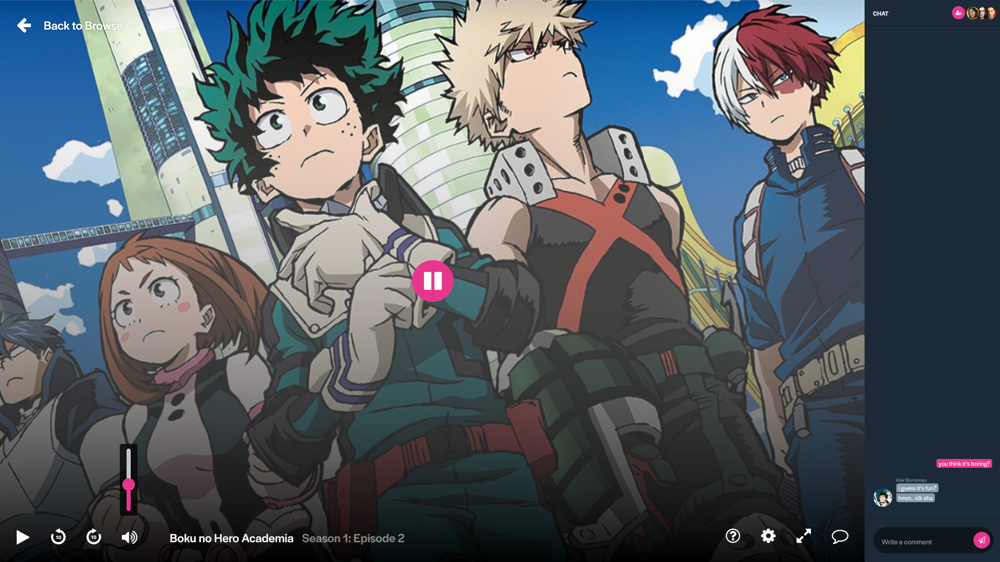

## Care.tv
Care.tv makes it really easy to enjoy movies or watch TV shows with the people you care about, no matter how far!

## API Setup
You will have to install these dependencies: [MySQL `5.7`](https://dev.mysql.com/downloads/mysql/5.7.html), [php `>=7.2`](https://thishosting.rocks/install-php-on-ubuntu/) along with [Composer](https://getcomposer.org/), and [ngrok](https://ngrok.com)

- Move to the `api` folder.
```bash
cd api
```
- Install the dependencies
```bash
composer install
```

- Copy `.env.example` to `.env`, and setup your environment config. Particularly, the database credentials (`DB_*`).
```bash
cp .env.example .env
```

- Run the migrations. Don't forget to store the client id and secret output from running `php artisan passport:client`.
```bash
php artisan migrate
php artisan passport:install
php artisan passport:client --password
```

- [Setup `ngrok`](https://dashboard.ngrok.com/get-started), then point it to port `8000`.
```bash
ngrok http 8000
```

- Setup [Pusher](https://pusher.com/) by logging in to its dashboard, and creating a client. When you're done, open up `.env`, and change the following with the details provided by Pusher:
```bash
PUSHER_APP_ID=
PUSHER_APP_KEY=
PUSHER_APP_SECRET=
PUSHER_APP_CLUSTER=
```

- Go to the _Web Hooks_ tab, then paste ngrok's generated url (e.g., `http://9542199e.ngrok.io `) to the _Webhook URL_ input.

- Select _Presence_ for the _Event Type_, then press _Add_.

- You should be good to go
```bash
php artisan serve
```

## Front-end setup
You will need npm `>=5` and Node.js `>=10`.

- Move to the `ui` folder
```bash
cd ui
```

- Install the dependencies
```bash
npm i
```

- Copy `.env.example` to `.env`, and setup your environment config. Update the `API_CLIENT_*` based on the output from `php artisan passport:client --password` (refer to instructions above).
```bash
cp .env.example .env
```

- Start Parcel, and you're all good.
```bash
npm start
```

It should open up to your a new browser window shortly. However, if it doesn't, you can manually open http://localhost:3000.

## Deployment
The API and front-end are deployed separately.

### API
Currently, Pulse is deployed on Laravel Forge. For the initial deployment, don't forget to run:
```bash
php artisan passport:install
php artisan passport:client --password
```

### Front-end
The web interface is hosted on Netlify for free.
- Set the root folder to `ui`; the public folder to `dist`.
- Set the environment config accordingly.
- For the build command:
```bash
npm run build
```

## Custom API Commands
```bash
# Lists the most recent parties since 3 days ago
php artisan app:list-pt
# Lists the most recent parties since 5 days ago
php artisan app:list-pt 5

# Lists the last 15 registrations
php artisan app:list-users
# Lists the last 30 registrations
php artisan app:list-users 30
```

## Attribution
- [DrawKit](https://www.drawkit.io/illustrations/drawing-woman-colour) for the free illustrations pack.
- [Notification Sounds](https://notificationsounds.com/sound-effects) for the notification audio files.